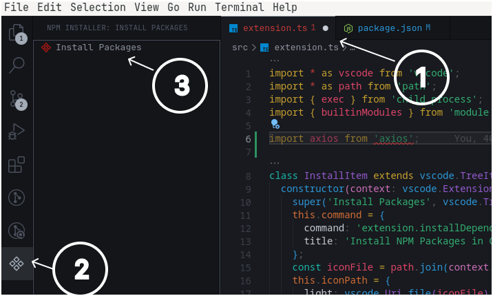

# Missing NPM Packages Installer



**Note: Make sure the current file that has missing-pkgs mentioned, is in `active view/currently opened` in vscode (step 1).**

A simple VS Code / VSCodium extension that scans the currently open JavaScript/Typescript file for `import` and `require` statements and installs any missing external npm packages with a single click from an Activity Bar(vs-code-sidebar) icon.

---

## Features

- **One-click install**  
  Click the “NPM Installer” icon in the Activity Bar → click **Install Packages** → installs only the missing external packages used in your open file.

- **Built-in detection**  
  Automatically skips Node.js core modules (e.g. `fs`, `path`, `http`) and only installs real dependencies.

- **Scoped / deep imports**  
  Detects both top-level (e.g. `lodash`) and scoped packages (e.g. `@babel/core`).

---

## Prerequisites

```bash
    npm install --global @vscode/vsce
```

---

## Installation

```bash
   git clone https://github.com/arun0808rana/missing-pkgs-installer.git
   cd missing-pkgs-installer
```

---

## Generating an extension(.vsix file) from this repo

```bash
npm install
npm run compile
npm run package
```

## Installing the package

- Inside `build` folder right click on the `missing-pkgs-installer.vsix` file and select the `Install extension VSIX` from the context menu.

---

## Example


In the above example `extension.ts` file has `axios` mentioned in the code. But its not installed. Click on the `icon` (step 2). Then click on the `Install Packages` option on the sidebar(step 3);
